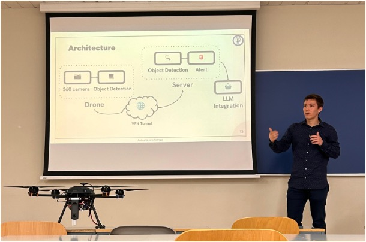
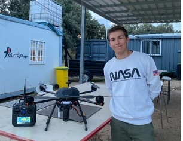

# Bachelor Thesis for the Bachelor Degree in Data Science and Engineering

## Title: Applications of Autonomous Drones for Non-Terrestrial Networks in Remote Areas

---

This work has been awarded a grade of 9.4/10 and it has been done by [Andres Navarro Pedregal](https://www.linkedin.com/in/andresnav) under the supervision of José Alberto Hernández.

Here are some cool videos:

- [https://youtu.be/F1fDpXw-kBg?si=oVI7ABBirbrGqtMg](https://youtu.be/F1fDpXw-kBg?si=oVI7ABBirbrGqtMg)
- [https://youtu.be/IqNsVOT3uFQ?si=dWXqM65URh07QSvX](https://youtu.be/IqNsVOT3uFQ?si=dWXqM65URh07QSvX)
- [https://youtu.be/kdMgwRRte-8?si=KGCrkTCeSnTrycTO](https://youtu.be/kdMgwRRte-8?si=KGCrkTCeSnTrycTO)

You can find the latex template used [here](https://github.com/andres-nav/templates/blob/main/thesis_uc3m.sty).

### Abstract

This bachelor thesis presents the design, implementation, and testing of an autonomous drone system for non-terrestrial networks in remote areas. The project aims to provide researchers with an open-source, cost-effective solution for studying and deploying drone-based networks in challenging environments. The system consists of a modular Unmanned Aerial Vehicle (UAV), a control station, and a reconnaissance platform. The UAV is designed to be easily customizable, using off-the-shelf components for accessibility and maintainability. It features autonomous flight capabilities and can carry various sensors for different applications. The control station allows real-time monitoring and control of the UAV, while the reconnaissance platform processes data collected by the drone using advanced computer vision and machine learning techniques. The system incorporates a 360-degree camera and on-board processing capabilities, enabling real-time object detection and tracking. Integration with large language models enhances the system's analytical capabilities, providing detailed insights about detected objects. Testing demonstrated the system's ability to fly autonomously, detect and analyze objects in real-time, and communicate data effectively over long distances. With a flight time of 30-40 minutes and a modular design, the developed system offers a versatile platform for applications such as surveillance, search and rescue, and environmental monitoring in remote areas.
